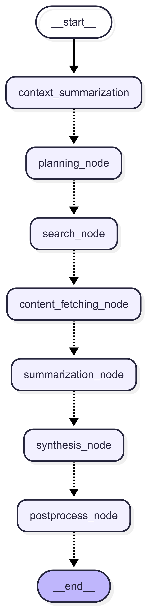

# Context-Aware Research Brief Generator

## Problem Statement

Large Language Models (LLMs) like GPT-4 are powerful but need structured guidance to deliver context-rich, accurate research briefs. This project aims to generate well-organized research briefs on a given topic, with configurable depth and support for follow-up questions using LangGraph, LangChain, and FastAPI.

## Objective

Design and implement a graph-based, context-aware pipeline that:

- Accepts a topic, user ID, depth (1–3), and a follow-up flag
- Plans the research in multiple steps
- Searches and extracts data from the web
- Summarizes and compiles the results into a final brief
- Saves briefs to a PostgreSQL database using Tortoise ORM
- Provides both a CLI and REST API interface

## Tech Stack

- Async Python
- LangGraph + LangChain
- FastAPI
- PostgreSQL + Tortoise ORM
- Tavily, Newspaper3k etc.

## Graph Architecture



```text
START
  |
  v
Context Summarization (load past briefs if follow-up)
  |
  v
Planning Node (break topic into steps)
  |
  v
Search Node (generate search queries)
  |
  v
Content Fetching Node (fetch full article content)
  |
  v
Summarization Node (summarize each source)
  |
  v
Synthesis Node (compile final brief)
  |
  v
Postprocess Node (validate + persist)
  |
  v
END
```

LangGraph is used to build this pipeline with asynchronous, state-aware transitions.

## Model & Tool Selection

| Component       | Tool/Library                       | Rationale                               |
| --------------- | ---------------------------------- | --------------------------------------- |
| Graph Execution | LangGraph                          | Flexible async workflow modeling        |
| Language Model  | GPT-4o-mini / llama-3.1-8b-instant | Strong natural language understanding   |
| Prompting       | LangChain PromptTemplates          | Prompt engineering support              |
| Web Search      | Tavily API                         | Fast, developer-friendly search results |
| Article Parsing | Newspaper3k                        | Extracts full-text content from URLs    |
| Database ORM    | Tortoise ORM + Aerich              | Async ORM for FastAPI                   |
| API Layer       | FastAPI                            | High-performance REST APIs              |
| CLI Interface   | `argparse` + `asyncio`             | Script-based usage for quick testing    |

## 🧾 Schema Definitions

### ResearchStep

```python
class ResearchStep(BaseModel):
    step_id: int
    description: str
```

### SearchResult

```python
class SearchResult(BaseModel):
    title: str
    url: str
    content: str
    summary: Optional[str] = None
    relevance_score: Optional[float] = None
```

### WebSearchResult

```python
class WebSearchResult(BaseModel):
    query: str
    answer: Optional[str]
    results: List[SearchResult]
```

### SourceSummary

```python
class SourceSummary(BaseModel):
    source_url: str
    summary: str
    relevance_score: float
```

### FinalBrief

```python
class FinalBrief(BaseModel):
    topic: str
    steps: List[ResearchStep]
    summaries: List[SourceSummary]
    compiled_summary: str
    references: List[WebSearchResult]
```

### State Object

```python
class ResearchGraphState(TypedDict):
    topic: str
    user_id: str
    depth: int
    follow_up: bool
    prior_context: Optional[str] = None
    plan: Optional[List[ResearchStep]] = None
    search_results: Optional[List[WebSearchResult]] = None
    source_summaries: Optional[List[SourceSummary]] = None
    compiled_summary: Optional[str]
    final_brief: Optional[FinalBrief] = None
```

## 🚀 Deployment Instructions

### 1. Clone & Set Up Virtual Environment

```bash
git clone <repo-url>
cd research_assistant
python -m venv .venv
source .venv/bin/activate
pip install -r requirements.txt
```

### 2. Configure Environment

Create a .env file at the root of your project with the following env variables.

```env
OPENAI_API_KEY=your_key
GROQ_API_KEY=your_key
TAVILY_API_KEY=your_key
LANGSMITH_PROJECT="ai_researcher"
LANGSMITH_TRACING="true"
LANGSMITH_TRACING_V2="true"
LANGSMITH_ENDPOINT="https://api.smith.langchain.com"
LANGSMITH_API_KEY=your_key
DATABASE_URL="postgres://<YOUR_USERNAME>:<YOUR_PASSWORD>@localhost/ai_researcher"
MAX_SEARCH_RESULTS=3
```

### 3. Initialize DB & Migrations

```bash
aerich init -t app.db.config.TORTOISE_ORM
aerich init-db
```

### 4. Run FastAPI Development Server

```bash
fastapi dev app/main.py
```

### 5. Run CLI

```bash
python3 -m app.cli --topic "can ai replace humans in next 5 years?" --depth 1 --userid ps189
```

## 🧪 Example Input & Output

### CLI Input

```bash
--topic "impact of AI in education" --depth 3 --followup --userid user42
```

### Final Output Snippet (FinalBrief)

```json
{
  "topic": "impact of AI in education",
  "steps": [...],
  "summaries": [...],
  "compiled_summary": "AI has significantly transformed education by ...",
  "references": [...]
}
```

## Cost & Latency Benchmarks (Multi-Model Comparison)

| Depth | Avg. Tokens | Model        | Provider | Cost (USD)     | Latency (s)    |
| ----- | ----------- | ------------ | -------- | -------------- | -------------- |
| 2     | ~6K         | GPT-4o       | OpenAI   | ~$0.01         | ~20–30s        |
| 3     | ~12K        | GPT-4o       | OpenAI   | ~$0.02–0.03    | ~40–60s        |
| 1     | ~2K         | GPT-4o-mini  | OpenAI   | ~$0.001–0.0015 | ~3–5s ⚡       |
| 2     | ~6K         | GPT-4o-mini  | OpenAI   | ~$0.004        | ~5–10s         |
| 3     | ~12K        | GPT-4o-mini  | OpenAI   | ~$0.007–0.01   | ~10–20s        |
| 1     | ~2K         | LLaMA 3.1 8B | Groq     | ~$0.0002       | ~0.5–1.0s ⚡⚡ |
| 2     | ~6K         | LLaMA 3.1 8B | Groq     | ~$0.0005       | ~1.5–2.5s      |
| 3     | ~12K        | LLaMA 3.1 8B | Groq     | ~$0.001        | ~2.5–3.5s      |

### Notes:

- **GPT-4o-mini :** Due to it's small size, it provides good latency.
- **Groq's LLaMA 3.1 8B :** on Groq is ultra-low due to their specialized LPU (Language Processing Unit) hardware.
- **Token counts** include both input and output tokens.
- Costs and times may vary depending on prompt size and load.

## Limitations

- No optimization yet for High latency which is caused by multiple web queries and content extraction.
- Output depends on the freshness and quality of Tavily results.
- No deduplication or hallucination detection yet.
- No semantic similarity scoring yet for source relevance.

## Future Improvements

- Add semantic vector scoring to rank results
- Integrate citation formatting (APA/MLA)
- Add Langfuse/PromptLayer observability
- Frontend to view briefs and manage history
- Model selection toggle (GPT-4o-mini vs LLaMA 3.1 8B Instant)
